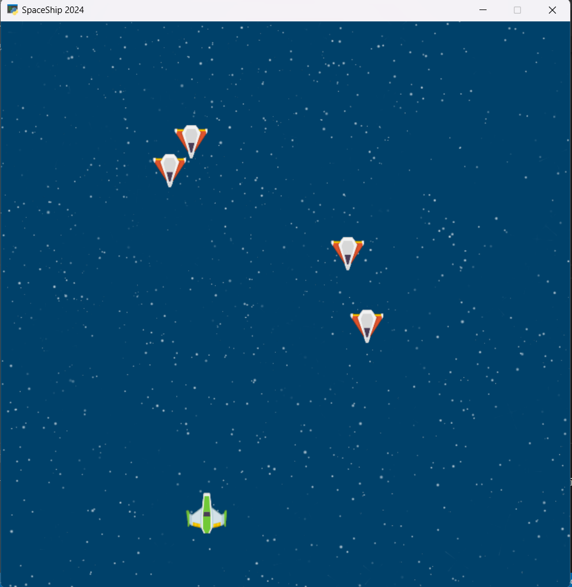
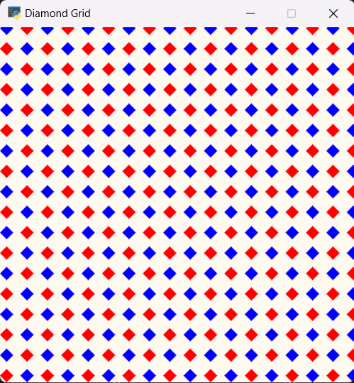

# 13th Assignments in Python 

## 1- SpaceShip Game
### Description:

- This program is a simple space game featuring a user-controlled spaceship and enemies moving towards the user.

---
**Install the arcade package:**
```
pip install arcade
```
Usage:

- The user can maneuver the spaceship using the left and right arrow keys to avoid colliding with enemies.

Picture of Game:


---

## 2- Diamond Grid
### Description:
- This program displays a grid of colored diamonds in a window.

Usage:

- The program displays a grid of colored diamonds where every other row and column alternates between red and blue colors.

Picture of Game:

