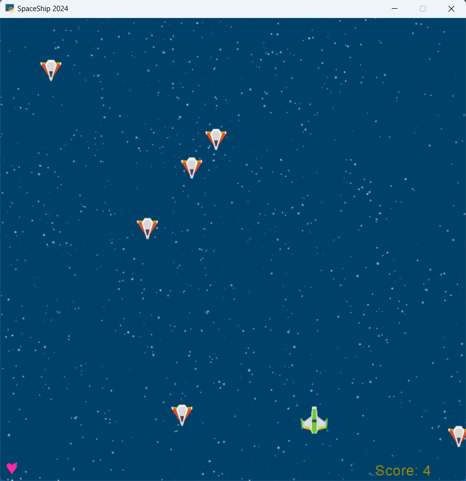

# 14th Assignments in Python 

## Compelete SpaceShip Game

**How to Play:**

1. Controls:
- Left arrow key (or A key): Move the spaceship to the left.
- Right arrow key (or D key): Move the spaceship to the right.
- Spacebar: Shoot lasers to destroy enemy ships.

2. Objective:
- Defend your planet from incoming enemy ships.
- Destroy as many enemy ships as possible to increase your score.

3. Game Over:
- The game ends when you run out of lives.
- Your final score will be displayed, and you can restart the game to try again.
---

---

[Watch Gameplay Video](spaceship.mp4)