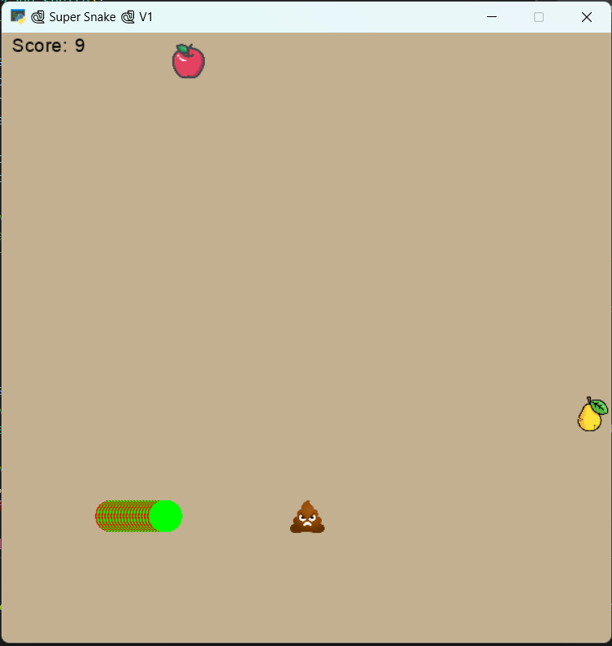

# 15th Assignments in Python 

## Super Snake Game

## Controls

- Use the arrow keys to control the snake's direction:
- UP: Move the snake upwards
- DOWN: Move the snake downwards
- RIGHT: Move the snake to the right
- LEFT: Move the snake to the left

## Game Rules

- Eat fruits (apples or pears) to earn points and avoid poo obstacles.
- The game ends if the snake collides with a poo obstacle or goes out of bounds.

---

---

---

---
