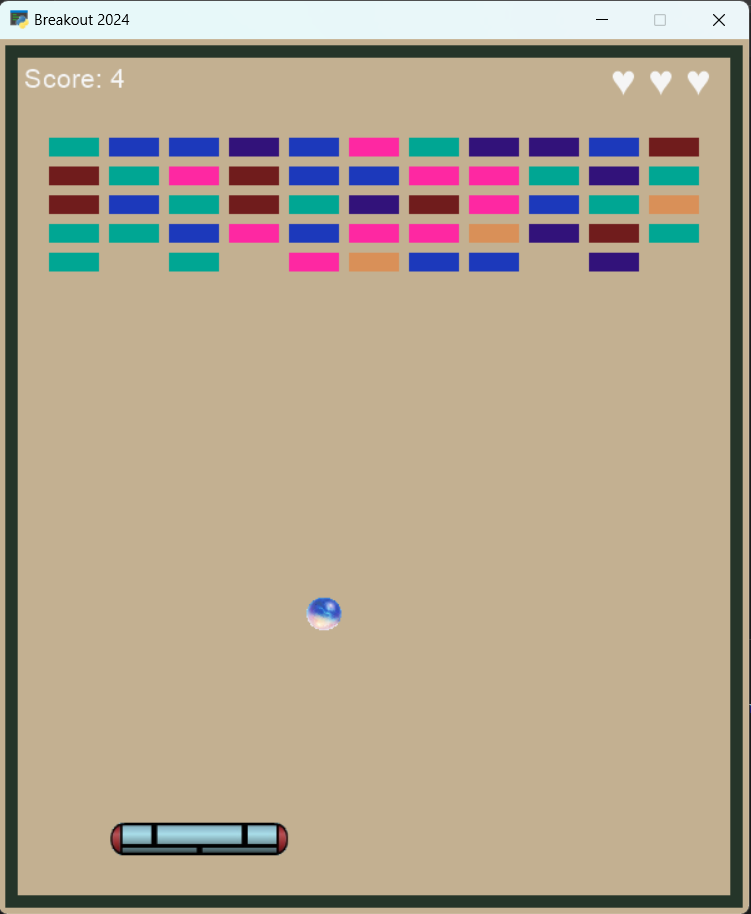
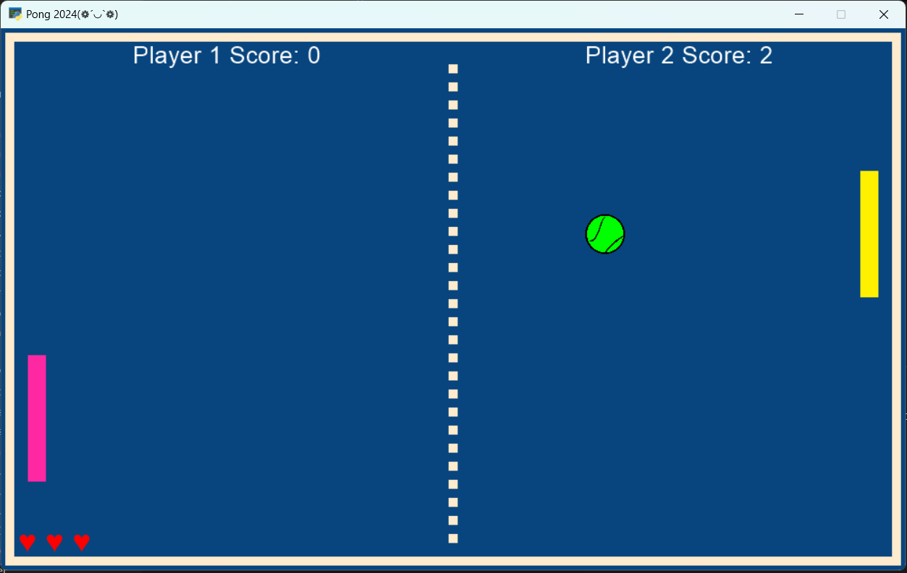

# 16th Assignments in Python 

# 1- Breakout (❁´◡`❁)
Breakout is a simple arcade game where players control a paddle to bounce a ball and destroy bricks. The game features:


- **Controls**: Use arrow keys or mouse to move the paddle.
- **Gameplay**: Bounce the ball off the paddle to destroy bricks and earn points.
- **Lives**: Players start with three lives. Lose a life if the ball falls off the screen.
- **Scoring**: Destroy bricks to increase the score.
- **Game Over**: The game ends when all lives are lost.


## How to Play

- Use arrow keys or mouse to control the paddle.
- Bounce the ball to destroy bricks and earn points.
- Avoid letting the ball fall off the screen to prevent losing lives.

## Requirements
```
- Python 3.x
- Arcade library
```
### You can see a picture of game here:
---


---


# 2- Pong (❁´◡`❁)
Pong is a simple arcade game where players control rockets to bounce a ball back and forth. The game features:


- **Controls**: Use mouse movement to control Rocket player 1.
- **Gameplay**: Bounce the ball off the rockets to score points.
- **Lives**: Player 1 starts with 5 lives indicated by heart symbols.
- **Scoring**: Players earn points by hitting the ball past their opponent's rocket.
- **Game Over**: The game ends when Player 1 loses all lives.


## How to Play

- Move the mouse up and down to control Rocket player 1.
- Bounce the ball off the rockets to score points.
- Player 1 loses a life if the ball passes their rocket.
- The game ends when Player 1 loses all lives.

## Requirements
```
- Python 3.x
- Arcade library
```
### You can see a picture of game here:
---

---